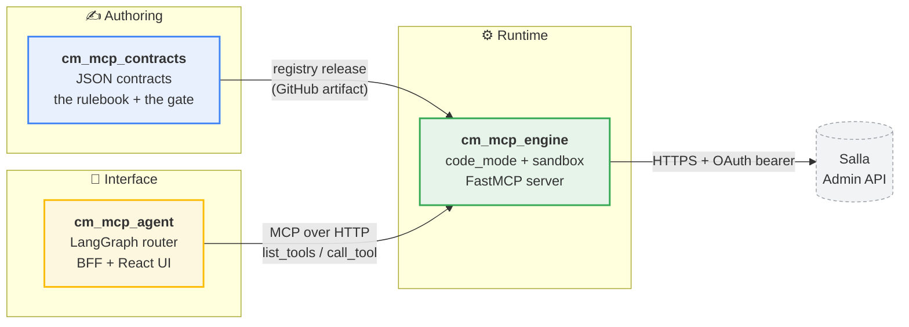

# Platform documentation

Reference documentation for the three repositories that make up the contract-based
code-mode MCP platform.

| Document | What it covers |
|---|---|
| [architecture.md](architecture.md) | The three repositories, their internals, the boundaries between them, and how they deploy |
| [ci-cd-workflows.md](ci-cd-workflows.md) | Every GitHub Actions workflow — inside each repo and across the three — and what fires it |
| [code-mode-runtime.md](code-mode-runtime.md) | How `cm_mcp_engine` turns a contract into Python and runs it, stage by stage |
| [contributor-prompt.md](contributor-prompt.md) | Ready-made briefing for someone (or something) writing a contract |
| [contract-authoring-skill.md](contract-authoring-skill.md) | The same briefing as a reusable agent skill, for delegating contract submissions repeatedly |

## The platform in one picture



**One sentence each.** `cm_mcp_contracts` decides *what tools may exist*.
`cm_mcp_engine` decides *how they run and against what credential*.
`cm_mcp_agent` decides *which one answers a prompt*. No repository does two of those.

## The one-line version of the flow

```
write JSON  →  gate  →  merge  →  registry release  →  engine verifies  →  human pins  →  deploy  →  tool exists
```

Nobody writes server code anywhere in that line.

## Reading order

New to the platform: [architecture.md](architecture.md) → [code-mode-runtime.md](code-mode-runtime.md) → [ci-cd-workflows.md](ci-cd-workflows.md).

Debugging "my tool never appeared": [architecture.md § Reading the pipeline's state](architecture.md#8-reading-the-pipelines-state)
→ [ci-cd-workflows.md § The cross-repo pipeline](ci-cd-workflows.md#9-the-cross-repo-pipeline-end-to-end)
→ [architecture.md § Where contracts come from](architecture.md#42-where-contracts-come-from--the-one-rule).

Debugging "the answer is wrong / stale": [code-mode-runtime.md § The two caches](code-mode-runtime.md#7-the-two-caches).

---

*Diagrams are Mermaid and render natively on GitHub. Line references point at the
code as of the writing of these docs; treat them as signposts, not addresses.*
