# Architecture

Three repositories, one platform. This document describes what each one is, what
lives inside it, and — the part that matters most — the boundaries between them
and why each boundary is where it is.

- [1. The system at a glance](#1-the-system-at-a-glance)
- [2. Why three repositories](#2-why-three-repositories)
- [3. cm_mcp_contracts — the rulebook](#3-cm_mcp_contracts--the-rulebook)
- [4. cm_mcp_engine — the hands](#4-cm_mcp_engine--the-hands)
- [5. cm_mcp_agent — the brain and the showcase](#5-cm_mcp_agent--the-brain-and-the-showcase)
- [6. The three boundaries](#6-the-three-boundaries)
- [7. Deployment topology](#7-deployment-topology)
- [8. Reading the pipeline's state](#8-reading-the-pipelines-state)

---

## 1. The system at a glance

### 1.1 Context diagram

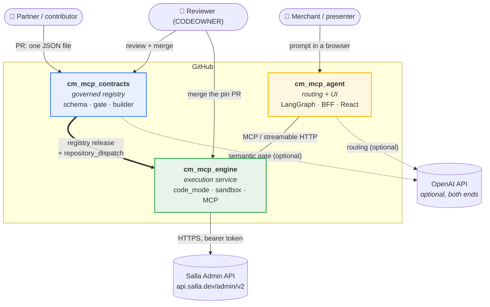

### 1.2 What each repository owns

| | cm_mcp_contracts | cm_mcp_engine | cm_mcp_agent |
|---|---|---|---|
| **Role** | The rulebook | The hands | The brain + the showcase |
| **Decides** | which tools may exist | how a tool runs, and on what credential | which tool answers a prompt |
| **Never** | executes anything | decides anything | executes anything |
| **Language** | Python (scripts only) | Python | Python + TypeScript |
| **Runtime artifact** | a registry tarball | a FastMCP HTTP service | a FastAPI service + SPA |
| **Holds secrets?** | no (CI keys only) | **yes** — the store's OAuth token | no |
| **Knows the upstream host?** | no | **yes** — one table | no |
| **Knows the contracts?** | **yes** — it owns them | yes — the pinned copy | no — only what MCP exposes |
| **Tests** | 54 | 90 | 28 |

### 1.3 The lifecycle of one capability

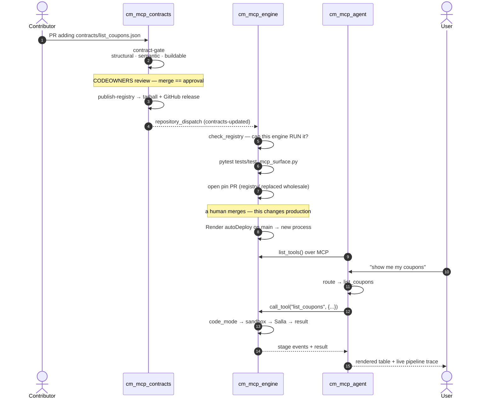

Total human decisions in that chain: **two merges.** Total lines of server code
written to add the capability: **zero.**

---

## 2. Why three repositories

The split is not by technology — it is by **who is allowed to change what**.

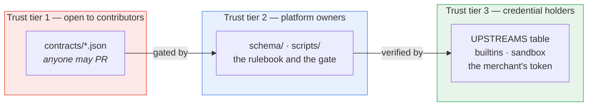

A contributor writing a contract can widen the platform's capability surface.
They **cannot**:

- name a host (`binding` has no field for one — enforced by the schema),
- name a credential (only *scopes*, which the reviewer reads in the diff),
- add an upstream (that is a change to `UPSTREAMS` in the engine repo),
- register a builtin (that is a change to `builtins.py` in the engine repo),
- decide whether the engine can execute their contract (`consume-registry` answers that).

If contracts and engine shared a repository, one PR could add both a contract and
the upstream it points at. The split is what makes "where does a merchant's OAuth
token travel" a question with an answer that is reviewed by the people who hold it.

---

## 3. cm_mcp_contracts — the rulebook

**Add an API capability by submitting one JSON file. No server code.**

### 3.1 Layout

```
cm_mcp_contracts/
├── schema/
│   └── tool-contract.v3.json      the one rulebook — owners only
├── templates/
│   └── single-tool.template.json  copy-and-fill starter
├── contracts/                     ← the approved lane; contributors PR here
│   ├── list_brands.json
│   ├── list_categories.json
│   ├── list_orders.json
│   ├── list_order_statuses.json
│   └── list_products.json
├── scripts/
│   ├── validate_contracts.py      structural + cross-reference checks
│   ├── eval_contracts.py          semantic review (LLM-as-judge / heuristics)
│   ├── build_registry.py          → dist/registry/  (index + one file per contract)
│   └── demo_gate.ps1              watch bad contracts get rejected
├── tests/
│   ├── fixtures/invalid/          deliberately broken — must stay rejected
│   ├── test_contracts.py  test_consistency.py
│   ├── test_registry_build.py  test_salla_rules.py
└── .github/workflows/
    ├── contract-gate.yml          PR gate
    └── publish-registry.yml       merge → artifact → notify engine
```

### 3.2 Anatomy of a contract

One endpoint, one tool, one file. Four layers, each answering one question:

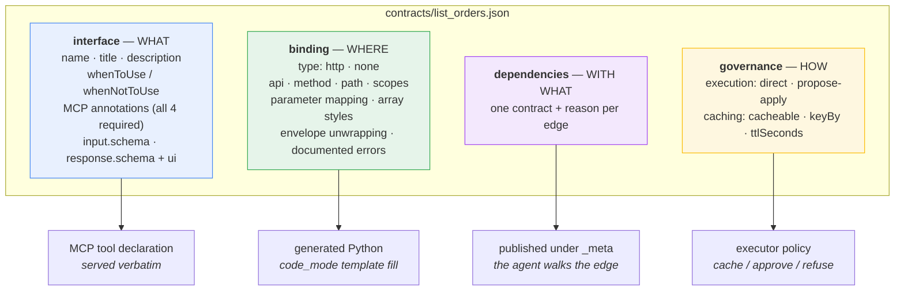

**The critical property**: `binding` never leaves the engine. `Catalog.public_view()`
in [`loader.py`](../../cm_mcp_engine/cm_engine/registry/loader.py) emits name,
description, hints, input schema and annotations — and nothing else. The boundary is
enforced by the MCP protocol, not by convention.

### 3.3 The gate — three jobs, each answering a different question

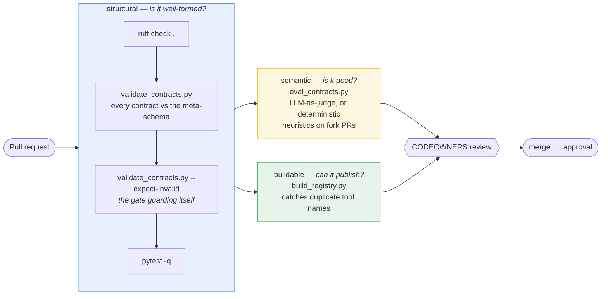

**What JSON Schema alone cannot express** — and so is hand-written in
`consistency_problems()`, `dependency_problems()` and `resolver_problems()`:

| Check | The failure it prevents |
|---|---|
| every `{placeholder}` has a `parameters.path` entry, and vice versa | a request URL with a literal `{coupon_id}` in it |
| every mapping reads a **declared** argument | a filter silently dropped because nobody can pass it |
| every **required** argument reaches the request | requiring an argument and ignoring it |
| `caching.keyBy` names real arguments | a cache key over a field that does not exist |
| `validation.rules[].field` names real arguments | a guard that never runs |
| `dependencies[].contract` exists in the lane | *(this actually happened)* `list_orders` shipped depending on `list_order_statuses`, which was not in the registry |
| a resolver's `path`/`dataPath` match the contract it names | the inlined copy drifting from its source |
| a resolver's target is **read-only** and its scopes are a subset | a lookup that writes, or that widens the blast radius |

### 3.4 Governance cross-checks (all enforced)

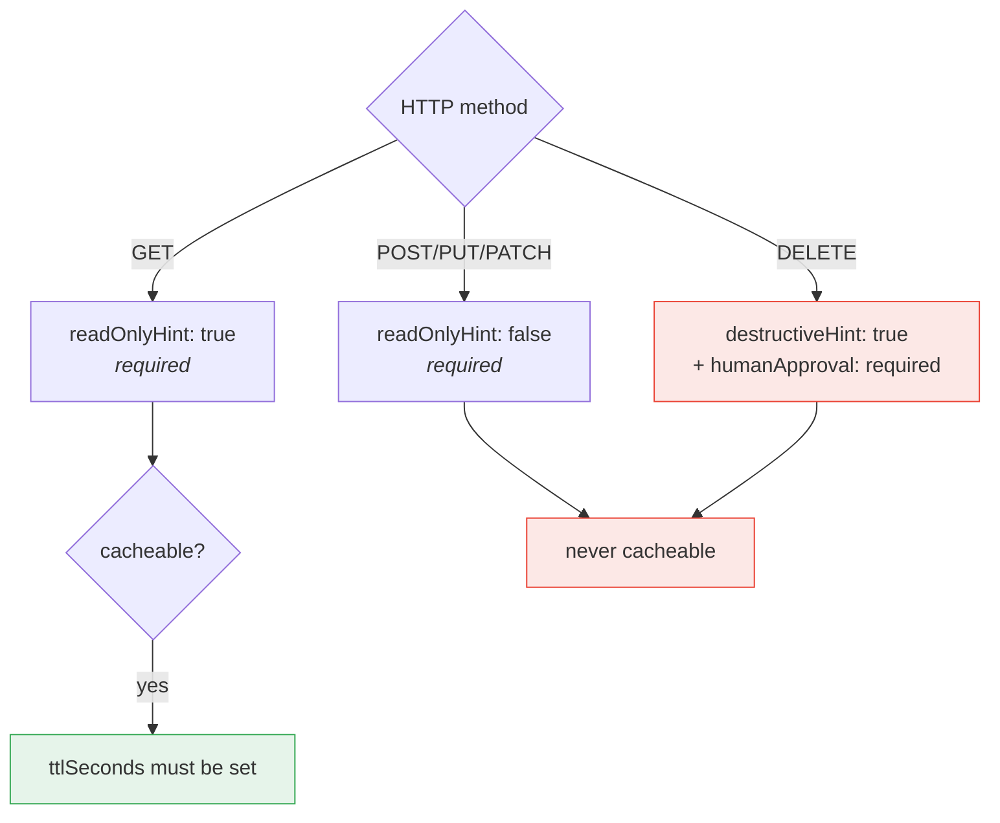

Least privilege runs both ways: a read-only tool may hold only `.read` scopes, and a
writing tool **must** hold a `.read_write` scope. Grants are per app installation, so
an over-broad ask affects every store that installs the app.

### 3.5 The published artifact

`build_registry.py` produces an **index plus one file per contract** — never one
inlined blob:

```
dist/registry/
├── registry.json                      provenance + sha256 per contract
└── contracts/
    ├── list_categories.json           byte-for-byte, canonically formatted
    ├── list_orders.json
    └── …
```

```jsonc
{
  "generatedAt":  "2026-08-12T06:26:21+00:00",
  "sourceRepo":   "cm_mcp_contracts",
  "sourceCommit": "0ce6bc7…",          // traceability
  "schemaId":     "…/tool-contract.v3.json",  // the engine refuses what it cannot serve
  "layout":       "index",
  "contentHash":  "de58b9f…",          // contracts+versions+hashes, NOT the build stamp
  "toolCount":    4,
  "toolNames":    ["list_categories", "list_order_statuses", "list_orders", "list_products"],
  "contracts": [
    { "name": "list_orders", "version": "2.0.0",
      "path": "contracts/list_orders.json", "sha256": "2b765ef…" }
  ]
}
```

Three design decisions worth naming:

1. **One file per contract** — at five tools this is cosmetic; at five hundred it
   decides whether the engine's pin PR is reviewable. A diff shows *which* tool
   changed, `git blame` keeps answering, and two updates to different tools do not
   conflict.
2. **`contentHash` excludes the build stamp** — every publish writes a fresh
   `generatedAt` and `sourceCommit`. Without this hash, a commit that touched a
   script and no contract would arrive downstream as a PR to review.
3. **Canonical bytes, written with `write_bytes`** — text mode rewrites newlines on
   Windows, so the file on disk would be CRLF while the hash was taken over LF, and
   the artifact would fail its own integrity check on the platform that built it.

---

## 4. cm_mcp_engine — the hands

**Turns approved contracts into runnable code, sandboxes it, caches it, serves it
as MCP tools. Makes no decisions.**

### 4.1 Module map

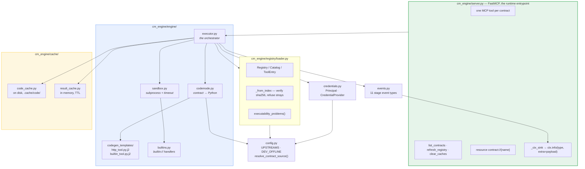

### 4.2 Where contracts come from — the one rule

**This engine reads its own repository.** What it serves is `./registry/registry.json`
— the registry the pipeline published, `consume-registry` verified, and a human
merged *here*.

It used to auto-detect a sibling `../cm_mcp_contracts/contracts` checkout. That was
convenient and wrong: the contracts working tree holds whatever someone is editing,
on whatever branch, including contracts that never passed the gate. An engine reading
it serves unapproved tools *while reporting a tool count that looks perfectly
legitimate*. There is now no path to another repository in the code, and
[`tests/test_own_repo_only.py`](../../cm_mcp_engine/tests/test_own_repo_only.py) fails
if one comes back.

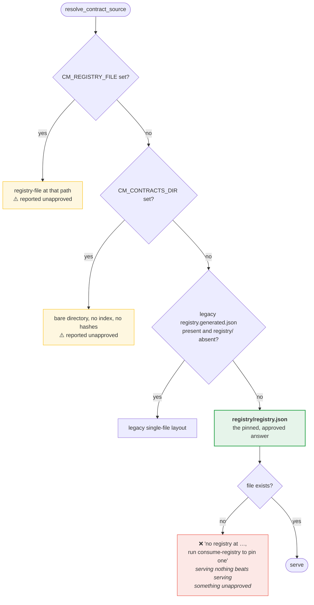

**The index is what makes a directory a registry.** The engine serves what the index
lists, verified byte-for-byte:

| Situation | What happens |
|---|---|
| listed, hash matches | ✅ served |
| edited after publication | ❌ refused — hash mismatch named in the warning |
| present but unlisted | ❌ refused — unlisted means never published |
| listed but missing | ❌ refused — named against its tool |
| index path escaping the registry | ❌ refused — an index is data from another repo |

So **"approved" means "listed in an index the pipeline produced and a human merged"**,
not "present on disk".

### 4.3 Validation: schema vs executability

The engine deliberately does **not** re-validate contracts against the JSON Schema.
That is the gate's job, and duplicating the rulebook would give us two versions of it
to disagree. What it checks instead is the question the other repo cannot answer:
**can this engine run it?**

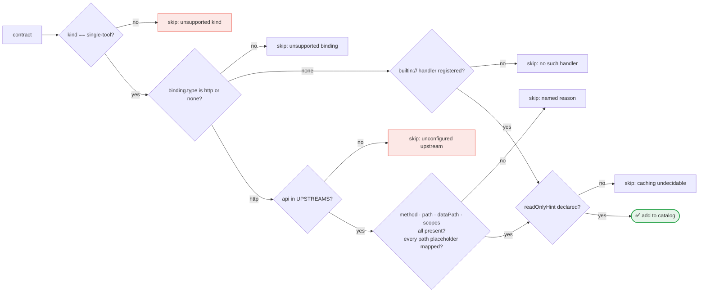

**One unrunnable contract is skipped loudly, not fatally** — the rest of the
partners' tools keep working and the warning says exactly why. Warnings surface at
startup on stdout, in `list_contracts()`, and in amber in the UI.

Run it by hand:

```bash
uv run python scripts/check_registry.py registry/registry.json
uv run python scripts/check_registry.py --contracts-dir path/to/contracts
```

### 4.4 Schema-version compatibility — a one-way hazard

`SUPPORTED_SCHEMA_IDS` accepts both v1 and v2. The asymmetry is deliberate:

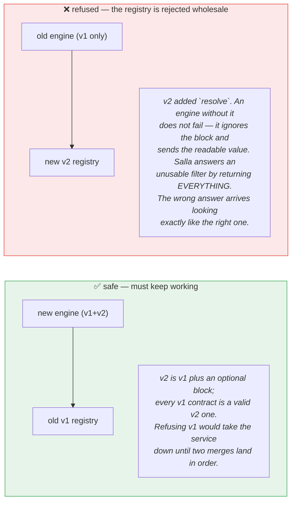

### 4.5 Upstreams live here, not in contracts

A contract names an upstream — `binding.http.api: "salla"` — and stops there.

| name | base URL | credential | offline target |
|---|---|---|---|
| `salla` | `https://api.salla.dev/admin/v2` | bearer `SALLA_ACCESS_TOKEN` | `http://127.0.0.1:8787/admin/v2` |

`DEV_OFFLINE=1` exists for the test suite alone: it resolves every upstream to
[`tests/mock_upstream.py`](../../cm_mcp_engine/tests/mock_upstream.py) — same envelope,
same pagination, same error shape, so the generated code is identical either way. The
mock is a test fixture and not part of the distributed package, so a *running* engine
cannot serve simulated data.

### 4.6 How a credential reaches a call — four security properties

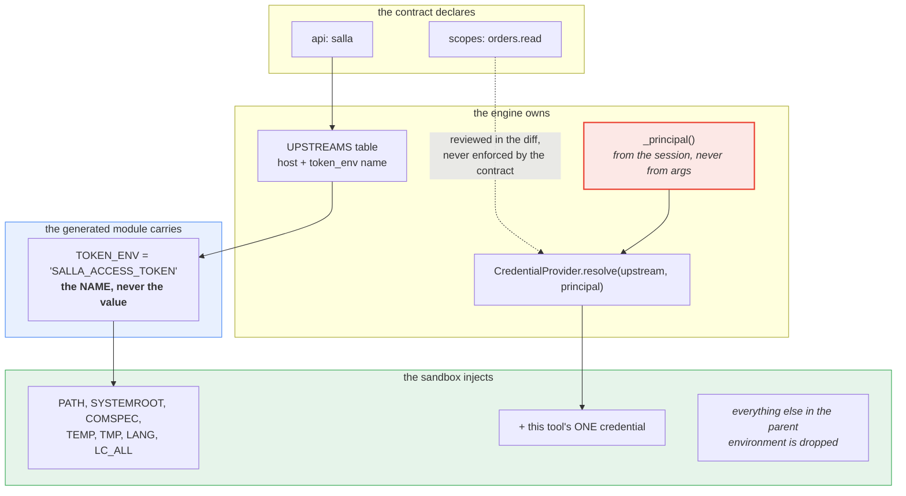

1. **The contract names an upstream and a set of scopes. Nothing else.** No host, no
   credential, no way to express one. Least privilege is reviewable because the ask
   is in the diff.
2. **The generated module carries the *name* of an environment variable, never a
   value.** Generated code is cached on disk and shown to an audience; a token in it
   would be a token in both.
3. **The sandbox environment is an allowlist plus this tool's one credential.** A
   tool cannot read a secret it never asked for, and cannot read another upstream's
   at all.
4. **The principal is decided by the engine, never by the arguments.** Tool arguments
   are written by a language model, so anything reachable from them is reachable by
   whoever can put text in front of it. `_principal()` in
   [`server.py`](../../cm_mcp_engine/cm_engine/server.py) is where a deployment maps
   an authenticated MCP session to the merchant install behind it;
   [`tests/test_principal.py`](../../cm_mcp_engine/tests/test_principal.py) pins the
   confused-deputy case — an argument called `principal` changes nothing.

### 4.7 What a production deployment replaces

Everything below sits behind `CredentialProvider.resolve` in
[`credentials.py`](../../cm_mcp_engine/cm_engine/credentials.py) — the seam is right,
the implementation is a POC:

| Today | Production |
|---|---|
| one token per **process** (`EnvCredentials`, ignores the principal) | one token per **install** — Salla issues one per store, with refresh + expiry |
| `os.environ` | a secrets manager, with rotation and audit |
| `_principal()` returns a constant | derived from the authenticated MCP session |
| no token refresh | refresh before returning |

The tenant-scoped cache keys are already correct — and untested against real traffic.

---

## 5. cm_mcp_agent — the brain and the showcase

**Decides *which* contract answers a prompt and with *what* arguments, calls it over
MCP, and streams the whole pipeline to a two-pane UI. It executes nothing.**

There is no import of engine code here, and
[a test enforces that](../../cm_mcp_agent/tests/test_agent.py).

### 5.1 Layout

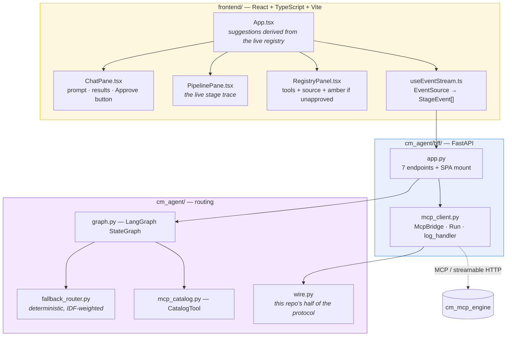

### 5.2 The routing graph

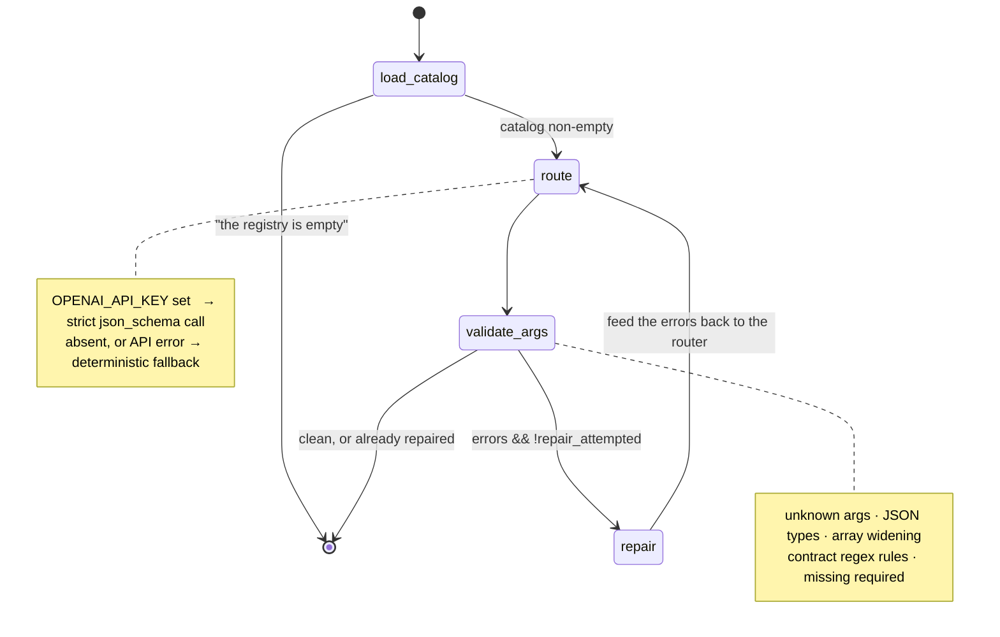

The catalog comes from `list_tools()`, so this service sees exactly what any MCP
client would — never a `binding`, never a secret.

**The offline router is load-bearing, not a stub.** Without it, "runs offline" stops
being true the moment the agent is involved. It scores prompts against each
contract's own `whenToUse` / `whenNotToUse` with **IDF weighting** — so vocabulary
shared across contracts, like "order", cannot decide a route — and extracts
arguments using the contract's own validation regexes, matched against whole tokens.

It also **withholds a destructive tool unless that tool's distinctive name token is
in the prompt**. `cancel_order`'s own description mentions "shipped", so *"has
ORD-123456 shipped?"* would otherwise reach it. Mis-routing a read to a write is the
worst failure available here, so it is the one place with a hard gate.

Two guards worth naming in `validate_args`:

- **Array widening.** A router that resolved one status id and sent `1201821018`
  instead of `[1201821018]` made a shape mistake, not a judgement one, and there is
  exactly one list containing it. Worth coercing rather than a repair round trip —
  because the upstream does not error on the wrong shape; it drops the filter and
  returns everything, *which is the failure that started all of this*.
- **The args that go back are the coerced ones.** The BFF calls with what was
  validated, not with the shape the router happened to emit.

### 5.3 The wire contract — duplicated on purpose

The engine emits pipeline stages as MCP log notifications:

```json
{ "msg": "code_generated",
  "extra": { "stage_event": { "run_id": "run-8f2c…", "seq": 3, "ts": 0.0, "data": { … } } } }
```

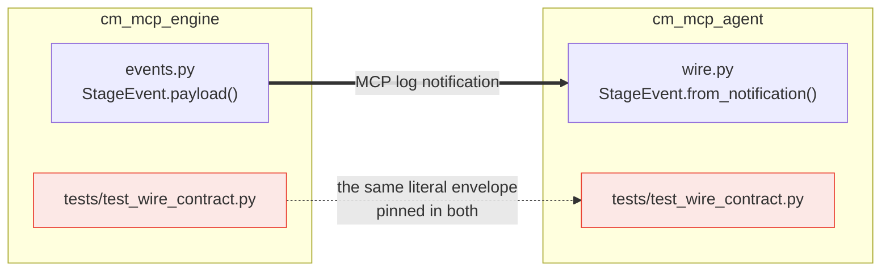

Two independently deployed services share a **wire format**, not a Python package.
Both repos pin the same literal envelope, so a drift turns a test red instead of
turning the right pane blank — *the only thing keeping two repositories honest about
a protocol they do not share code for.*

**Why one wrapper key** (`stage_event`) rather than a flat payload: `extra` becomes a
stdlib `LogRecord` on the emitting side, and `LogRecord` rejects reserved attribute
names. Two of our payloads collide — `proposal` carries `args`, every `error` carries
`message`. Spreading flat would make **error reporting the first thing to break.**

### 5.4 BFF endpoints

| Endpoint | Purpose |
|---|---|
| `POST /api/chat` | mints a `run_id` **and its queue**, returns immediately, routes and calls in the background |
| `GET /api/stream/{run_id}` | SSE; replays the buffer, then streams live, with 1s keepalives |
| `POST /api/approve/{run_id}` | the second MCP call, carrying the approval token |
| `GET /api/registry` · `POST /api/registry/refresh` | proxies the engine's meta tools |
| `GET /api/contract/{name}` | reads the engine's `contract://{name}` resource |
| `POST /api/cache/clear` | presenter reset between demo runs |
| `GET /healthz` | liveness, **including MCP connection state** |

Two ordering facts that are the likeliest causes of a blank right pane if got wrong:

1. **The run's queue is created before the tool call starts**, so a browser that
   subscribes a beat late still replays from `seq 0`.
2. **`/api/registry/refresh` reconnects first, then refreshes.** `refresh_registry`
   re-reads contracts *inside the engine*, but the tool surface this service can see
   was settled when its MCP session opened. After a registry merge redeploys the
   engine, refreshing over the old session asks a process that no longer serves this
   store.

### 5.5 Session resilience

The engine restarting is **normal operation** here — every registry merge redeploys
it, and it sleeps on Render's free plan.

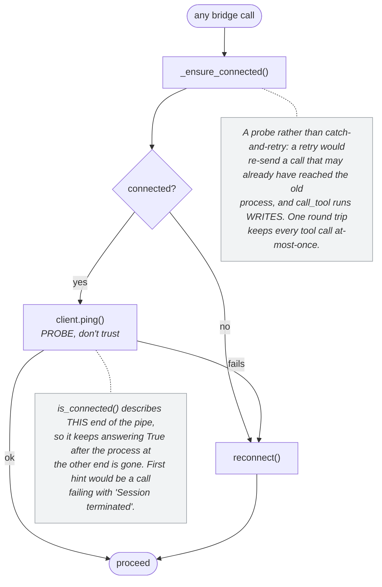

Startup is a **warm start, not a precondition**: if the engine is unreachable at boot
the BFF logs a warning and serves anyway — the health check cannot report "degraded"
from a container that exited.

### 5.6 The demo

| # | Prompt | What the audience sees |
|---|---|---|
| 1 | `where is order ORD-123456?` | right pane lights up stage by stage: routing (with rationale) → contract selected (JSON) → code generated (the real source) → executing → result → **CACHE STORE**. ~1s. |
| 2 | *the same prompt again* | **CACHE HIT**, single-digit ms, and the trace is visibly **shorter**: `code_generated` and `executing` are absent, because those stages did not run |
| 3 | `cancel order ORD-777888` | a destructive contract returns a proposal and mutates nothing until you click Approve |
| 4 | `how long does delivery take to a regional address by express?` | answered by a builtin, with no network at all |

---

## 6. The three boundaries

```mermaid
flowchart TB
    subgraph B1["Boundary 1 — the registry artifact"]
        direction LR
        X1["cm_mcp_contracts"] -->|"tarball + sha256<br/><i>verified, then pinned by a human</i>"| Y1["cm_mcp_engine"]
    end
    subgraph B2["Boundary 2 — MCP"]
        direction LR
        X2["cm_mcp_agent"] -->|"list_tools / call_tool<br/><i>binding never crosses</i>"| Y2["cm_mcp_engine"]
    end
    subgraph B3["Boundary 3 — the wire format"]
        direction LR
        X3["cm_mcp_engine"] -->|"MCP log notifications<br/><i>pinned by a test in both repos</i>"| Y3["cm_mcp_agent"]
    end

    style B1 fill:#e8f0fe,stroke:#4285f4
    style B2 fill:#e6f4ea,stroke:#34a853
    style B3 fill:#fef7e0,stroke:#fbbc04
```

| Boundary | Coupling | What crosses | What deliberately does not |
|---|---|---|---|
| contracts → engine | a GitHub release, consumed by a workflow | contract JSON + hashes + provenance | nothing executable; no host, no secret |
| agent → engine | one URL (`CM_MCP_URL`) | tool names, schemas, hints, args, results | `binding`, credentials, registry paths, engine internals |
| engine → agent | a literal envelope shape | 11 stage event types | Python objects — there is no shared package |

**What each repo can break in the others, and what catches it:**

| Change | Detected by |
|---|---|
| a contract the engine cannot execute | `consume-registry` → `check_registry.py` (before pinning) |
| an engine change that breaks an already-pinned contract | engine `ci.yml` → `check_registry.py` on every PR |
| a hand-edit to a pinned contract that skipped the pipeline | the sha256 check, in both `ci` and at load |
| a change to the stage-event envelope | `test_wire_contract.py` — in whichever repo did *not* change |
| a change to the tool surface the router was tuned on | agent `tests/fixtures/catalog.json`, a deliberate snapshot |
| a FastMCP upgrade breaking the live trace | engine `test_spike_fastmcp.py`, which pins the four assumptions |

---

## 7. Deployment topology

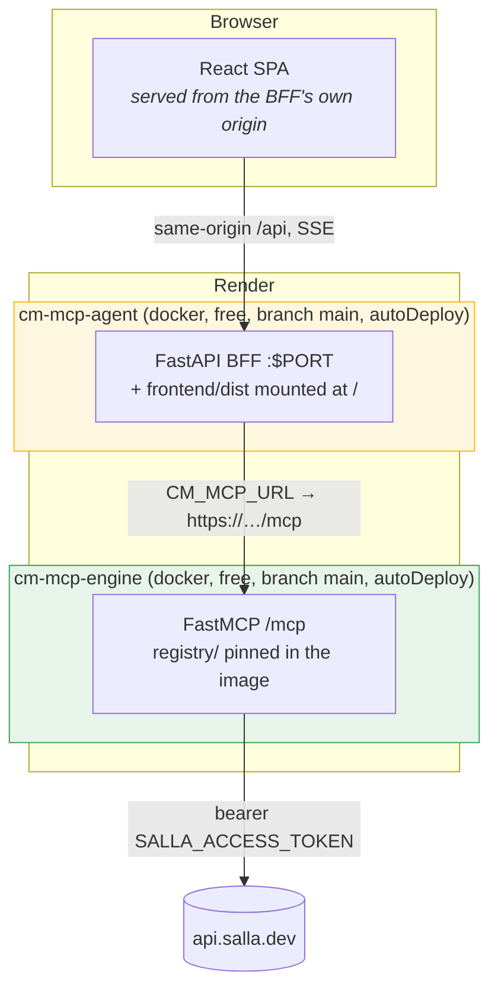

### 7.1 Environment

| Service | Variable | Value | Note |
|---|---|---|---|
| engine | `DEV_OFFLINE` | `0` | `1` answers from a local simulator — not what a live demo means |
| engine | `SALLA_ACCESS_TOKEN` | `sync: false` | prompted once, stored by Render; reaches generated code only as a *name* |
| engine | `CM_PRINCIPAL` | `render-demo` | scopes the credential lookup **and** the result cache |
| engine | `MCP_HOST` / `MCP_PORT` | `127.0.0.1` / `8765` | local defaults |
| agent | `CM_MCP_URL` | `sync: false` | the engine's URL + `/mcp`; assigned when the engine service is created, so a wrong value baked into git is worse than a prompt |
| agent | `OPENAI_API_KEY` | `sync: false` | optional — without it the deterministic router runs and the UI looks identical |
| agent | `CM_FRONTEND_ORIGINS` | *unset* | the UI is same-origin in production, so the CORS allowlist has nothing to do |
| agent | `CM_ROUTER_MODEL` | `gpt-5.1` | a bad model id degrades to the offline router rather than breaking the demo |

**No `healthCheckPath` on the engine, on purpose.** Its only HTTP surface is `/mcp`,
and FastMCP answers a bare GET there with an error by design — a health check pointed
at it would fail a service that is working perfectly. Render's port-binding check is
the honest signal.

**`healthCheckPath: /healthz` on the agent**, which returns 200 whether or not the
MCP connection is up and reports it in the body — so a sleeping engine shows as
*degraded* in the UI instead of taking this service down with it.

### 7.2 The deployment rule that makes the demo honest

`autoDeploy` on `main` **only**. A contract becomes callable when, and only when, a
human merges the pin PR that `consume-registry` opened in the engine repo. Nothing in
either blueprint can reach a contract that is still on a branch, and the engine reads
no checkout but its own.

### 7.3 Local development

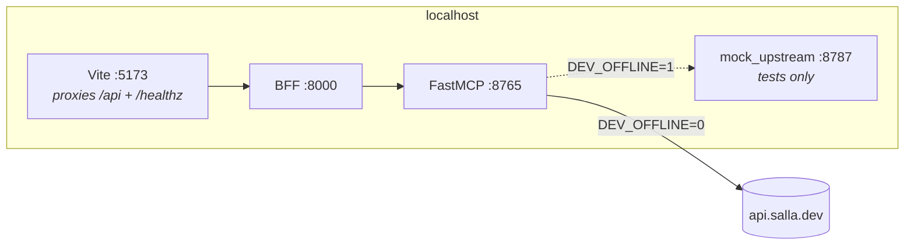

```bash
# agent repo — starts a sibling engine if present, then BFF + Vite
pwsh scripts/dev.ps1              # → http://localhost:5173
pwsh scripts/dev.ps1 -AgentOnly   # talk to whatever CM_MCP_URL points at
pwsh scripts/dev.ps1 -Stop

# engine repo — FastMCP alone, calling the real upstream
pwsh scripts/dev.ps1
```

The agent's launcher locates the engine via `CM_ENGINE_DIR` (default
`../cm_mcp_engine`) and **delegates to that repo's `dev.ps1`** rather than knowing how
to run it.

**To iterate on a contract locally**, build a registry from your contracts checkout
and point the engine at it — same index-and-hashes shape the pipeline publishes, so
local behaviour matches production:

```bash
cd ../cm_mcp_contracts && uv run python scripts/build_registry.py --out ../local-registry
cd ../cm_mcp_engine   && CM_REGISTRY_FILE=../local-registry/registry.json uv run python -m cm_engine.server
```

---

## 8. Reading the pipeline's state

Two questions answer almost every "why is my tool not there" — *what has been
approved*, and *what has been pinned*. They are different questions with different
answers, and the gap between them is not a bug: **publishing is automatic, pinning is
a human merge.**

```bash
# what has been APPROVED — the lane on cm_mcp_contracts main
git ls-tree --name-only origin/main contracts/

# what is PINNED — the index cm_mcp_engine actually serves
git show origin/main:registry/registry.json | jq '{schemaId, toolCount, toolNames}'

# what a RUNNING engine resolved — source, origin, and the DEV_OFFLINE flag
#   list_contracts() over MCP, or GET /api/registry through the agent's BFF
```

A worked example — the two repositories **in sync**, which is the steady state a
completed `consume-registry` cycle leaves behind:

| | approved lane (`cm_mcp_contracts/contracts/`) | pinned registry (`cm_mcp_engine/registry/`) |
|---|---|---|
| schema | `tool-contract.v3.json` | index declares `schemaId: …v3.json` |
| `list_brands` | `1.0.0` | `1.0.0` |
| `list_categories` | `1.0.0` | `1.0.0` |
| `list_coupons` | `1.0.0` | `1.0.0` |
| `list_orders` | `3.0.0` | `3.0.0` |
| `list_order_statuses` | `1.0.0` | `1.0.0` |
| `list_products` | `1.0.1` | `1.0.1` |
| tool count | 6 | 6 |

**When the two columns disagree, read it as a position in the pipeline, not as
breakage:**

| What you see | Where the change is | What moves it |
|---|---|---|
| in the lane, absent from the index | approved, not yet published or not yet pinned | check `publish-registry`, then `consume-registry` |
| a lower version pinned | the pin PR is open, or was never opened | merge it; a human merge is the design, not an oversight |
| the index declares an older `schemaId` | the engine has not taken a pin since the rulebook bumped | `consume-registry`, then merge |
| in the index, absent from the lane | a contract was deleted upstream and the pin has not caught up | the next pin replaces `registry/` wholesale, so it disappears |
| a running engine disagrees with `registry/` on `main` | the process predates the deploy, or an override is set | check `list_contracts().source.origin` |

The engine reports its resolved source at startup and from `list_contracts()` as
`{kind, path, origin}`. **A catalog that looks wrong is almost always a source that is
not what you assumed** — read that first, before anything else.

> **Note on the rulebook's version.** There is only ever one file: the current
> `schema/tool-contract.v3.json` is what `build_registry.py` and
> `validate_contracts.py` both load, and each bump retires its predecessor rather
> than keeping it alongside — an engine serving both would have to decide which
> features it may ignore per file, and the bumps so far cannot be ignored safely
> (a skipped `resolve` sends a slug the upstream answers with everything; a skipped
> A2UI surface renders nothing). When a document names an older file, trust
> `SCHEMA_PATH` in the validator and the `$schema` in the template over the prose.

---

## Appendix — POC gaps, stated plainly

From the engine's own README, reproduced here because a reader of the architecture
should not have to find them elsewhere:

- **The sandbox is not a security boundary.** A subprocess with a timeout and a
  scrubbed environment stops accidents and runaway loops, not untrusted code.
- **One credential per upstream, and one principal.** The seam is right; the
  implementation is a single environment variable.
- **No token refresh.** Salla access tokens expire; nothing here renews one.
- **`retryable` is surfaced, not acted on.** The engine reports that retrying may
  help and leaves the decision to the caller.
- **`dependencies` is declared but not resolved** — the schema models it, the engine
  publishes the edge under `_meta`, and nothing walks it automatically.
- **Approval tokens are process-local** and lost on restart.
- **Caches are in-memory plus a code directory** — no persistence, no eviction beyond
  TTL.
- **`multi-tool` and `openapi-import` contract kinds** remain future work; `kind`
  stays in the format so they can return without breaking existing contracts.
