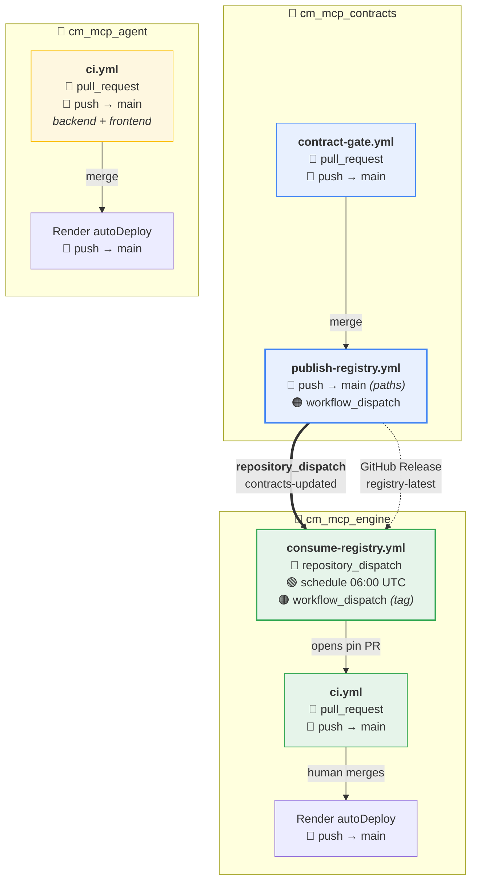
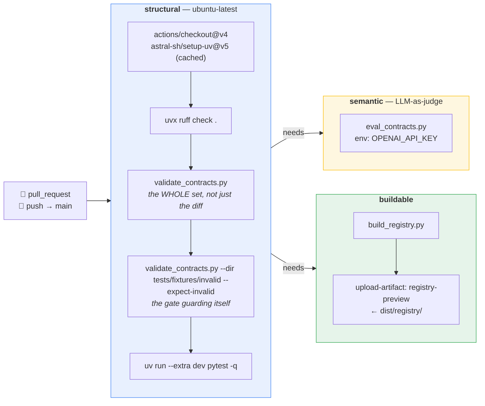
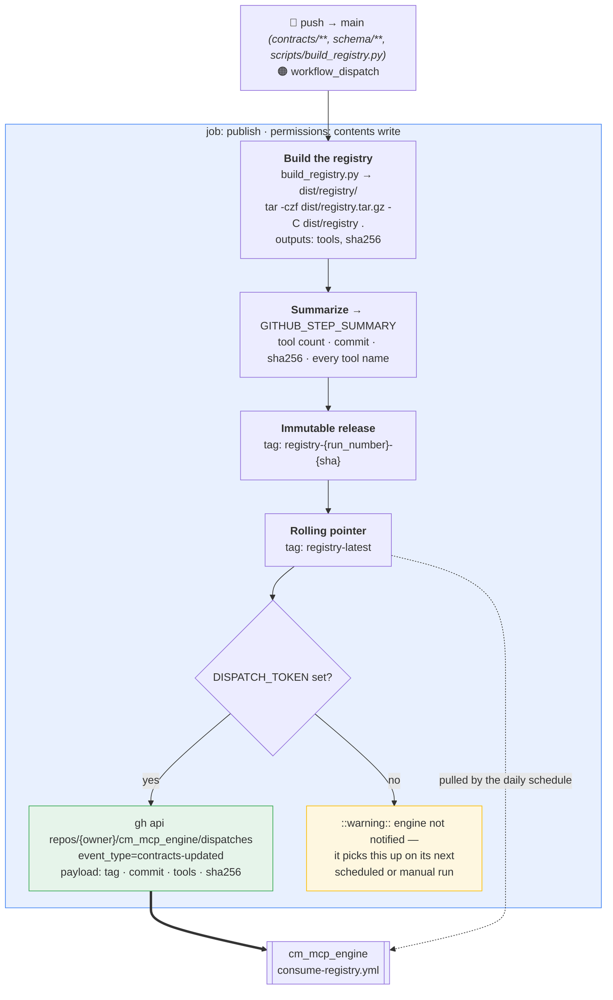
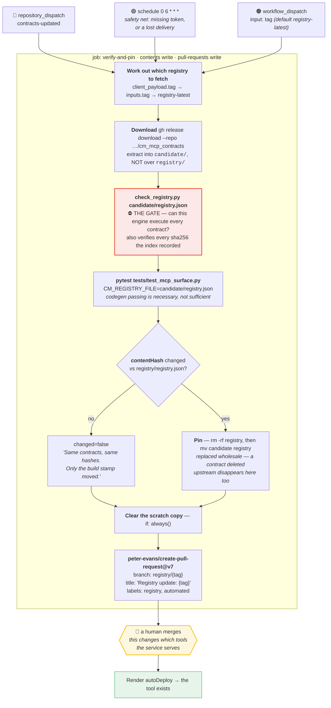
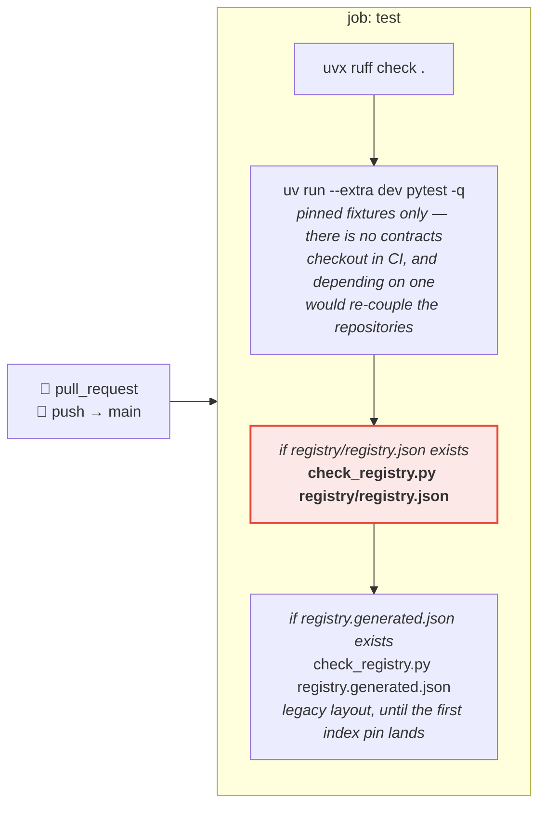
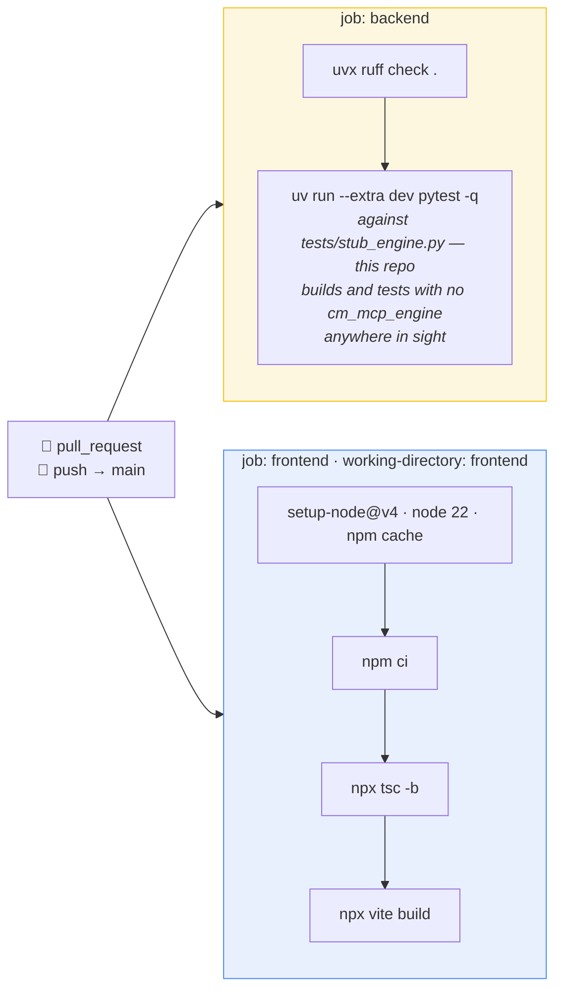
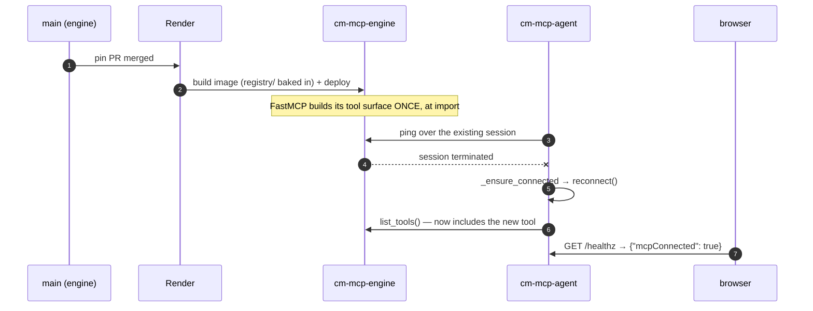
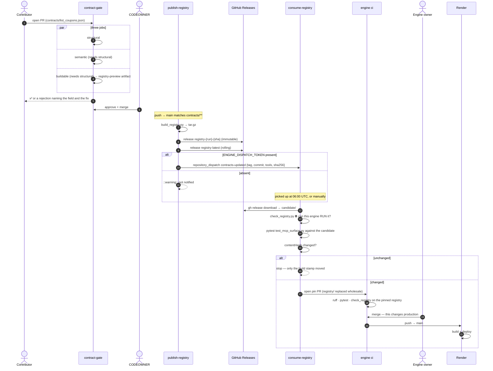
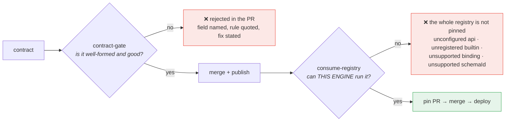
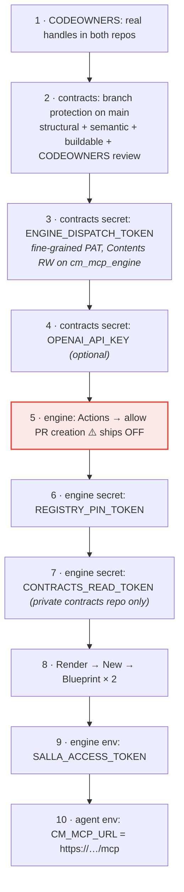

# GitHub workflows — within each repo, and between them

Five workflows across three repositories, plus two Render blueprints. This document
covers what each one is, exactly what fires it, what it does, and where it hands off.

- [1. The whole picture](#1-the-whole-picture)
- [2. Trigger matrix](#2-trigger-matrix)
- [3. cm_mcp_contracts — contract-gate.yml](#3-cm_mcp_contracts--contract-gateyml)
- [4. cm_mcp_contracts — publish-registry.yml](#4-cm_mcp_contracts--publish-registryyml)
- [5. cm_mcp_engine — consume-registry.yml](#5-cm_mcp_engine--consume-registryyml)
- [6. cm_mcp_engine — ci.yml](#6-cm_mcp_engine--ciyml)
- [7. cm_mcp_agent — ci.yml](#7-cm_mcp_agent--ciyml)
- [8. Deployment (Render)](#8-deployment-render)
- [9. The cross-repo pipeline, end to end](#9-the-cross-repo-pipeline-end-to-end)
- [10. Secrets and one-time setup](#10-secrets-and-one-time-setup)
- [11. Failure modes and how to read them](#11-failure-modes-and-how-to-read-them)

---

## 1. The whole picture



🔵 automatic on an event · 🟢 automatic on a schedule · 🟠 manual

**The only cross-repository link is the dashed/bold pair between `publish-registry`
and `consume-registry`** — a `repository_dispatch` for immediacy, and a GitHub Release
that the daily schedule can pull if the dispatch never arrives. There is no shared
runner, no shared cache, and no shared package.

---

## 2. Trigger matrix

| Workflow | Repo | `pull_request` | `push: main` | `repository_dispatch` | `schedule` | `workflow_dispatch` |
|---|---|:---:|:---:|:---:|:---:|:---:|
| `contract-gate` | contracts | ✅ any branch | ✅ | — | — | — |
| `publish-registry` | contracts | — | ✅ *paths-filtered* | — | — | ✅ |
| `consume-registry` | engine | — | — | ✅ `contracts-updated` | ✅ `0 6 * * *` | ✅ *`tag` input* |
| `ci` | engine | ✅ | ✅ | — | — | — |
| `ci` | agent | ✅ | ✅ | — | — | — |
| Render deploy | engine, agent | — | ✅ | — | — | ✅ *(dashboard)* |

`publish-registry`'s path filter — only these three change what the engine gets:

```yaml
paths:
  - 'contracts/**'
  - 'schema/**'
  - 'scripts/build_registry.py'
```

A commit touching `README.md`, `tests/`, or the other scripts does not publish.

---

## 3. cm_mcp_contracts — contract-gate.yml

> *PR gate. Nothing reaches the registry without passing.*



**Why each step is where it is:**

| Step | Reason it exists |
|---|---|
| `ruff check .` | unused code, commented-out code, and the small decay that accumulates — cheap to keep green now, expensive to reintroduce later |
| validate **every** approved contract, not just the diff | tightening the schema must not leave an older contract silently non-conforming |
| `--expect-invalid` on the broken fixtures | guards the gate itself: if a schema edit accidentally makes these valid, **the gate has stopped gating** |
| semantic falls back to heuristics with no key | that is what happens on fork PRs — the check still means something there rather than silently passing |
| `buildable` runs the real builder | catches duplicate tool names *on the PR* rather than after merge |
| the `registry-preview` artifact | a reviewer can download the exact artifact the merge would publish |

`semantic` and `buildable` both `needs: structural` and then run **in parallel** — no
point paying for a quality review of a contract that does not parse.

**What the semantic gate looks for** (from `eval_contracts.py`): boilerplate or
too-short-to-route descriptions, a missing `whenNotToUse` naming the sibling, a
paginated endpoint with no `page` argument, a careless input surface, and destructive
tools whose hints do not demand explicit intent. With `OPENAI_API_KEY` it is
LLM-as-judge (`CM_JUDGE_MODEL` overrides the model, default `gpt-5.1`); without it,
deterministic heuristics.

**Branch protection should require** the `structural`, `semantic` and `buildable`
checks, plus a CODEOWNERS review on `contracts/**`. **Merge is approval** — there is
no separate approve step downstream.

---

## 4. cm_mcp_contracts — publish-registry.yml

> *Merge is approval. This turns the approved set into the artifact the engine
> consumes, and tells the engine it exists.*



**Two releases, deliberately:**

| Tag | Mutability | Purpose |
|---|---|---|
| `registry-{run}-{sha}` | immutable | any pinned registry can always be traced back to the commit that produced it |
| `registry-latest` | rolling | gives the engine a stable URL to poll |

**One archive rather than one asset per contract** — the engine makes a single
download whether the registry holds one tool or five hundred. `tar -C dist/registry .`
puts `registry.json` at the archive root, so extracting gives the engine the directory
it pins verbatim.

**`DISPATCH_TOKEN` is lifted to job-level `env`** because the `secrets` context is not
dependable inside a step-level `if`; `env` is. And it must be a **fine-grained PAT** —
`GITHUB_TOKEN` cannot reach another repository. Without it, publishing still succeeds
and the pipeline simply degrades from "seconds" to "by 06:00 UTC tomorrow".

---

## 5. cm_mcp_engine — consume-registry.yml

> *The receiving half of the cross-repo pipeline.* `cm_mcp_contracts` can approve a
> contract that is perfectly schema-valid and still unrunnable here —
> `builtin://forecast_weather` with no such handler, an unsupported binding type, a
> template that will not render. Only this repo can answer that.



### 5.1 The five things the PR body promises were verified

```
- every contract matches the sha256 its index recorded
- every contract generates code this engine can run
- every `builtin://` handler it names exists here
- the MCP surface loads and serves the registry
```

…plus the layout guarantee: one file per contract under `registry/contracts/`, listed
in `registry/registry.json`. **The engine serves what the index lists and nothing
else, so the diff is the whole change.**

### 5.2 Four decisions worth understanding

**Extract to `candidate/`, not over `registry/`.** The repo's working tree stays
untouched until every check has passed. `Clear the scratch copy` runs `if: always()`
because `create-pull-request` commits the tree — a stray `candidate/` would end up in
the PR.

**Compare `contentHash`, not the file.** It covers contracts, versions and hashes —
*not* `generatedAt` or `sourceCommit`, which change on every publish. Without it, a
commit upstream that touched a script and no contract would arrive here as a PR to
review. That is review fatigue at exactly the scale the index layout exists to survive.

**A PR rather than a direct push.** Pinning a new registry changes which tools this
service serves in production. That deserves a human glance even though a machine
already proved it runs.

**`REGISTRY_PIN_TOKEN` decides whether the pin PR's own CI runs unattended.** Events
created with the default `GITHUB_TOKEN` cannot trigger further workflow runs —
GitHub's recursion guard — so the pin PR's `ci` run parks as `action_required` and a
human has to press *"Approve and run"* before the check proving this engine can
execute the registry will even start. With a real identity behind the PR, the run
starts by itself. It falls back to `GITHUB_TOKEN` when the secret is absent: the pin
PR still opens exactly as before, and only the approval click comes back.

---

## 6. cm_mcp_engine — ci.yml



Step C is the one that earns its place: it **guards against an engine change that
breaks a contract already in production**, which the contracts repo cannot detect. It
also re-checks every contract against the sha256 its index recorded, so a hand-edit to
a pinned contract that skipped the pipeline fails here.

Both registry steps are guarded with `hashFiles(...) != ''`, so a fresh clone with
nothing pinned yet still goes green.

**Test-suite design notes** (90 tests, no network, no ports):

| File | What it pins, and why it is shaped that way |
|---|---|
| `test_http_binding.py` | executes the generated code **for real** against the offline upstream — codegen producing parseable Python proves nothing about whether the request it builds is the one the contract described |
| `test_mcp_surface.py` | deliberately **registry-agnostic** — `consume-registry` runs it against a *candidate* registry whose tool list is whatever was just merged upstream, so nothing in it may name a particular tool. It asserts the contract-to-MCP mapping and the shape of the pipeline trace, which hold for a contract it has never seen |
| `test_wire_contract.py` | pins the stage-event envelope shared with `cm_mcp_agent`; the mirror lives in that repo |
| `test_own_repo_only.py` | fails if a path to a sibling contracts checkout comes back |
| `test_principal.py` | pins the confused-deputy case — an argument named `principal` changes nothing |
| `test_spike_fastmcp.py` | pins the four FastMCP assumptions the live trace rests on. If an upgrade breaks the demo, **this file fails first** |

---

## 7. cm_mcp_agent — ci.yml



The two jobs are independent and run in parallel. `tests/stub_engine.py` speaks the
same MCP surface as the real engine, so 28 tests run green with no engine anywhere.
Routing quality is judged against `tests/fixtures/catalog.json`, a **pinned snapshot**
of the tool surface the engine publishes — it changes deliberately, not incidentally.

Note that this repo's CI has **no cross-repo step at all.** It is coupled to the
engine by one URL at runtime and by one literal envelope in `test_wire_contract.py`;
neither needs the other repository present to verify.

---

## 8. Deployment (Render)

Both services are Render Blueprints (`render.yaml`), docker runtime, free plan,
`branch: main`, `autoDeploy: true`.



**The deployment rule that makes the demo honest:** `autoDeploy` on `main` only.
Nothing in either blueprint can reach a contract that is still on a branch, and the
engine reads no checkout but its own.

```
contracts PR merged → registry published → pin PR opened in the ENGINE
                    → a human merges it → Render deploys → the tool exists
```

**Manual deploy** is available from the Render dashboard for either service. Neither
blueprint runs tests — GitHub Actions is the gate, Render is the delivery.

**A caveat the agent's code is written around:** the engine builds its MCP tool
surface once, at import. A newly pinned tool exists only on a process that started
afterwards, and the agent holds a long-lived session against the *previous* process.
That is why `POST /api/registry/refresh` reconnects before it refreshes, and why every
bridge call probes the session first.

---

## 9. The cross-repo pipeline, end to end



### 9.1 Timing

| Path | Latency from merge to callable tool |
|---|---|
| dispatch token present, owner merges promptly | minutes |
| dispatch token absent | up to ~24h (next 06:00 UTC), then the merge |
| `workflow_dispatch` on `consume-registry` | immediate, at any time |

### 9.2 The two places a contract can be rejected



**A contract can pass the contracts gate and still be rejected downstream.** If your
tool never appears, watch the engine's `consume-registry` run. The rule that prevents
this: *a new upstream, a new `binding.type`, or a new `builtin://` handler is a change
in the engine repo, and it must land **before** a contract using it merges upstream.*

---

## 10. Secrets and one-time setup

### 10.1 Secrets

| Repo | Secret | Required? | What breaks without it |
|---|---|---|---|
| contracts | `OPENAI_API_KEY` | optional | the semantic gate downgrades from LLM-as-judge to deterministic heuristics *(this is also what fork PRs get)* |
| contracts | `ENGINE_DISPATCH_TOKEN` | recommended | the engine is not notified; it picks the registry up on its next scheduled or manual run. Must be a **fine-grained PAT with *Contents: read and write* on `cm_mcp_engine`** — `GITHUB_TOKEN` cannot reach another repository |
| engine | `CONTRACTS_READ_TOKEN` | only if contracts is **private** | `gh release download` cannot read the contracts repo's releases. For a public repo `GITHUB_TOKEN` is enough |
| engine | `REGISTRY_PIN_TOKEN` | recommended | the pin PR still opens, but its `ci` run parks as `action_required` until a human presses *"Approve and run"* |

Environment variables (not secrets): `CM_JUDGE_MODEL` overrides the semantic gate's
model; `CM_ROUTER_MODEL` overrides the agent's router model.

### 10.2 Repository settings

**`cm_mcp_engine` → Settings → Actions → General → Workflow permissions:**
tick **"Allow GitHub Actions to create and approve pull requests"**.

> The `pull-requests: write` permission in the workflow is **necessary but not
> sufficient** — GitHub gates PR creation by Actions behind that repo setting, which
> ships **off**. Without it, every step in `consume-registry` succeeds and only the
> last one fails, with *"GitHub Actions is not permitted to create or approve pull
> requests"*.

**`cm_mcp_contracts` → branch protection on `main`:** require the `structural`,
`semantic` and `buildable` checks, plus a CODEOWNERS review on `contracts/**`.
Replace `@owner` / `@reviewers` in `CODEOWNERS` with real handles.

**Render:** connect each `render.yaml` once (New → Blueprint). Set
`SALLA_ACCESS_TOKEN` on the engine and `CM_MCP_URL` on the agent in the dashboard —
both are `sync: false`, so they are prompted for and never live in git.

### 10.3 Setup checklist



---

## 11. Failure modes and how to read them

| Symptom | Where to look | Cause |
|---|---|---|
| PR rejected naming a field and a rule | `structural` job log | schema or cross-reference violation — the message states the fix |
| PR rejected on hints / routing quality | `semantic` job log | missing `whenNotToUse`, boilerplate description, paginated endpoint with no `page`, destructive tool not demanding explicit intent |
| PR fails only in `buildable` | `buildable` job log | duplicate tool name, or a dangling `dependencies` edge against the set actually being published |
| merged, but the engine never saw it | contracts → `publish-registry` run | `::warning:: ENGINE_DISPATCH_TOKEN is not set` — wait for 06:00 UTC or dispatch manually |
| merged, publish ran, no pin PR | engine → `consume-registry` run | either `check_registry` refused the registry (unconfigured `api`, unregistered builtin, unsupported `schemaId`), or `contentHash` was unchanged |
| every step green, the last one fails | engine → `consume-registry` → *Open a PR* | the repo setting in §10.2 is off |
| pin PR opened but its checks never start | the PR's Checks tab shows `action_required` | `REGISTRY_PIN_TOKEN` is absent — press *"Approve and run"*, or add the secret |
| pin PR merged, deployed, tool still missing in the UI | agent `/api/registry` → `source` | the BFF is holding a session against the pre-deploy engine process — hit `POST /api/registry/refresh`, which reconnects first |
| UI shows tools in **amber** | engine `list_contracts().source.origin` | the engine is running with `CM_REGISTRY_FILE` or `CM_CONTRACTS_DIR` set, i.e. an unapproved source |
| engine refuses to start: *"no registry at …"* | engine startup log | nothing pinned yet — that is the honest state of a fresh clone; run `consume-registry` |
| a stage never renders in the right pane | `test_wire_contract.py` in both repos | the envelope drifted; one of the two suites should already be red |

**First thing to check whenever the catalog looks wrong:** the engine prints its
resolved source at startup and reports it from `list_contracts()` —
`{kind, path, origin}`. A catalog that looks wrong is almost always a source that is
not what you assumed.
