# code_mode and the runtime

How `cm_mcp_engine` turns a JSON contract into Python, runs it, and reports every
stage of doing so. This is the part of the platform where "no server code" stops
being a slogan.

- [1. What code_mode is](#1-what-code_mode-is)
- [2. Generation — contract to source](#2-generation--contract-to-source)
- [3. The generated module](#3-the-generated-module)
- [4. The value resolver](#4-the-value-resolver)
- [5. Execution — the orchestrator](#5-execution--the-orchestrator)
- [6. The sandbox](#6-the-sandbox)
- [7. The two caches](#7-the-two-caches)
- [8. Propose-apply](#8-propose-apply)
- [9. Stage events](#9-stage-events)
- [10. A run, end to end](#10-a-run-end-to-end)
- [11. Failure taxonomy](#11-failure-taxonomy)

---

## 1. What code_mode is

**Deterministic template fill. No LLM.**

The contract already declares the endpoint, the parameter mapping, the envelope and
the failure modes — so generation is a template fill rather than an inference. That
makes it fast, repeatable, and **byte-stable**, which is in turn what makes the code
cache trustworthy: the same inputs always produce the same bytes, so a cache hit is
provably the same module a regeneration would have produced.

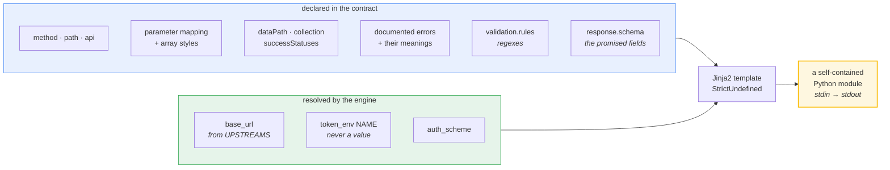

**Nothing is invented at generation time.** Every constant in the output traces to
either the contract or the engine's upstream table.

### Why this and not an LLM

| Property | Why it matters here |
|---|---|
| repeatable | the code cache can be keyed on inputs, because outputs are a function of them |
| byte-stable | a cache hit is indistinguishable from a regeneration |
| fast | generation is sub-millisecond; the demo's first call is ~1s end to end, almost all of it network |
| auditable | the code shown in the UI's right pane is the code that ran, and a reviewer can predict it from the contract |
| no key required | the whole platform runs with no API key anywhere |

---

## 2. Generation — contract to source

### 2.1 The pipeline

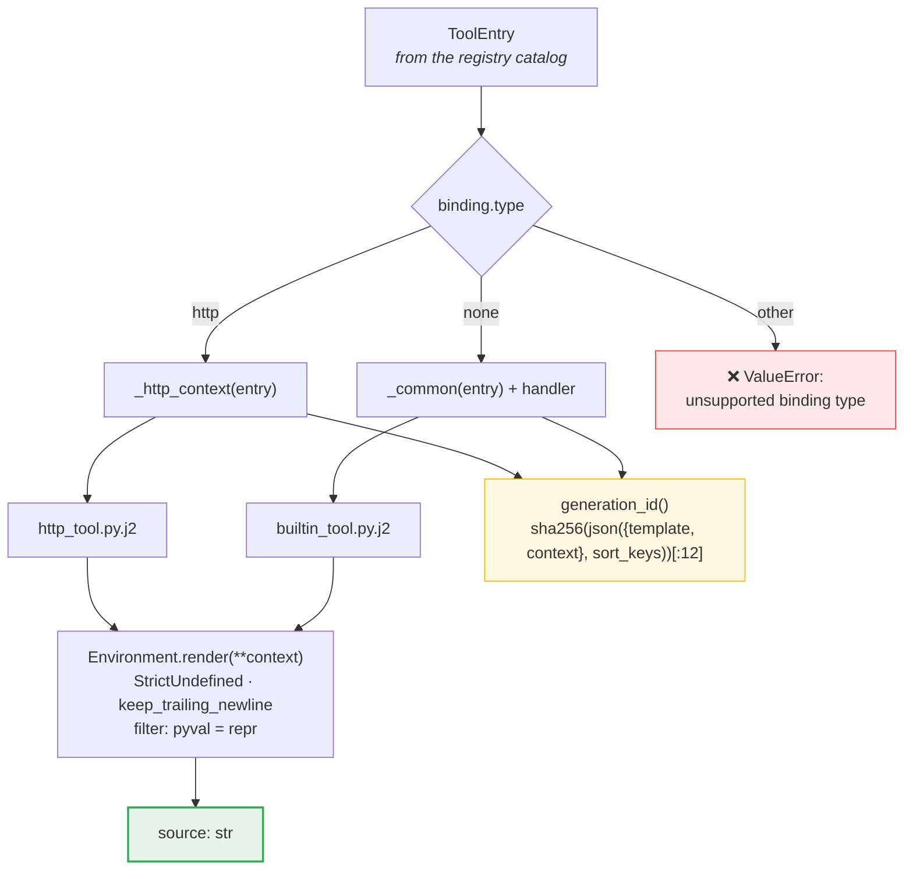

### 2.2 `_http_context` — what the contract becomes

| Context key | Source | Notes |
|---|---|---|
| `upstream`, `base_url`, `token_env`, `auth_scheme` | **the engine's `UPSTREAMS` table** | never the contract |
| `method`, `path_template`, `timeout_ms` | `binding.http` | `timeoutMs` defaults to 5000 |
| `scopes` | `binding.http.auth.scopes` | embedded so a 401 can name them |
| `path_params` | `parameters.path[]` → `{wire, arg}` | `from` defaults to `name` |
| `query_params` | `parameters.query[]` → `{wire, arg, constant, has_constant, style, resolver}` | a `constant` reads no argument — how a contract pins a filter the agent must not control |
| `body_mode`, `body_fields`, `consumed_args` | `parameters.body` | `consumed_args` is what decides where an argument lands under `passthrough` |
| `data_path`, `collection`, `pagination`, `success_statuses` | `binding.http.response` | `dataPath` split on `.` |
| `error_message_path`, `error_fields_path` | `response.errors` | default `error.message` / `error.fields` |
| `error_meanings` | `response.errors.statuses[]` | keyed **by status string**, so the generated code can name what a failure means |
| `response_fields` | `interface.response.schema.properties` | sorted — the projection allowlist |
| `required`, `forbidden`, `rules` | `interface.input` + `validation` | compiled into real guards |

### 2.3 `pyval = repr`, not `tojson`

```python
_env.filters["pyval"] = repr
```

The templates generate **Python**, so they need Python's spelling. JSON writes
`null` / `true` / `false`, which read as undefined names in Python and fail at import.
`repr` is deterministic for the `str/int/bool/None/list/dict` shapes a contract can
hold — which is precisely what keeps generation byte-stable and the code cache
trustworthy.

`StrictUndefined` means a context key the template expects and does not get is an
error at generation time, not a silently empty constant in a running tool.

### 2.4 `generation_id` — the cache identity

```python
generation_id(entry) = sha256(json({"template": …, "context": …}, sort_keys=True))[:12]
```

**Deliberately wider than the contract.** Three cases it covers that a version number
does not:

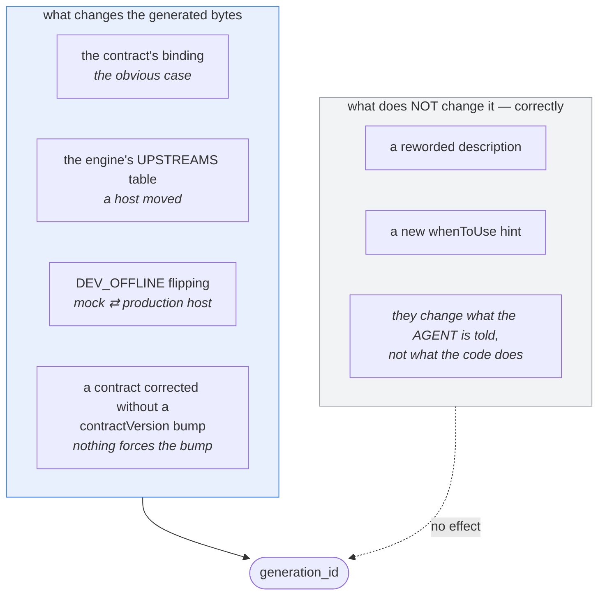

Without W3, turning `DEV_OFFLINE` off would hand back the offline module from the
on-disk cache and **quietly keep calling a mock instead of the store** — the on-disk
code cache outlives a restart, so this is not hypothetical.

### 2.5 `required_secrets`

```python
required_secrets(entry) -> [upstream.token_env]   # http bindings only; [] for builtins
```

The name comes from the **engine's upstream table, never from the contract** — a
contract cannot request a token. This list is exactly what the sandbox will inject.

---

## 3. The generated module

### 3.1 Two templates

| Template | For | Shape |
|---|---|---|
| `http_tool.py.j2` | `binding.type: "http"` | self-contained; imports only `json`, `os`, `re`, `sys`, `urllib.parse.quote`, `httpx` |
| `builtin_tool.py.j2` | `binding.type: "none"` | imports `cm_engine.engine.builtins.BUILTINS` and dispatches on the `builtin://name` handler; **no network, no secrets, works with the machine unplugged** |

Both share the same harness: read an args JSON object on stdin, write a result JSON
object on stdout. That is what lets the sandbox run them as a plain subprocess.

### 3.2 Anatomy of an HTTP tool module

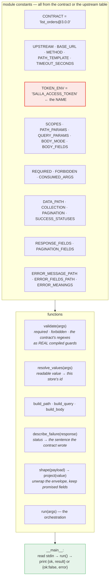

### 3.3 `run()` — the request lifecycle

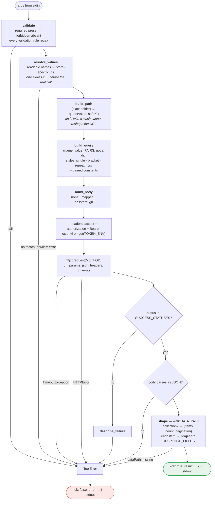

### 3.4 Four details worth calling out

**Query parameters are pairs, not a dict.** Bracket and repeat styles send the same
name more than once — which is how Laravel-shaped upstreams take arrays
(`status[]=1&status[]=2`). A dict cannot express that.

**Projection is a leak guard, not a formatting step.** `project()` keeps only the
fields `interface.response.schema` promised, so **a chatty upstream adding a field
does not leak it to the agent**, and the agent sees the shape it was told to expect.
Pagination is projected for the same reason and against a fixed allowlist
(`count, total, perPage, currentPage, totalPages`) — Salla sends prebuilt `links`
carrying an internal app id and an admin URL, and those stop here rather than
travelling into a model's context.

**A list endpoint and a single-record endpoint describe the same record.**
`response.schema` always describes **one** item, unwrapped. For a collection the
engine returns `{items, count, pagination}` and shapes each item to that schema — so a
category is described identically whether the tool fetches one or many.

**Failure becomes a sentence, not a body dump.** `describe_failure` assembles:

```
list_orders@3.0.0: salla returned 401
  -- The store's access token is missing, expired, or does not carry the orders.read scope…
  -- upstream said: "Unauthenticated."
  -- this endpoint needs the orders.read scope
  -- retrying the call unchanged may succeed        [only if retryable]
```

An **undocumented** status says so explicitly: *"a status this contract does not
document for this endpoint"*. `retryable` follows the contract's declaration where it
made one, and otherwise defaults to `429 or >= 500`.

---

## 4. The value resolver

The v2 schema addition, and the most subtle piece of the runtime.

**The problem.** The tool takes `status: ["shipped"]` — a word a person would say.
Salla's order filter wants the numeric id that state has **in this store**, which
differs per merchant and so cannot be written into a contract or known by an agent.
And Salla does not *reject* a filter it cannot use — **it ignores it and returns
everything.** The wrong answer arrives looking exactly like the right one.

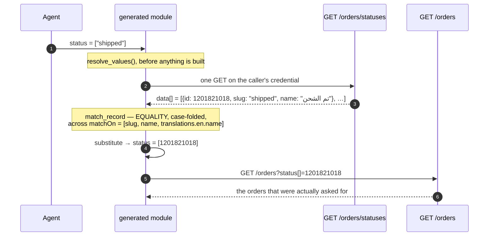

**Declared in the contract, inlined into the module:**

```jsonc
{ "name": "status", "style": "bracket",
  "resolve": {
    "contract":  "list_order_statuses",   // the sibling this copy must agree with
    "path":      "/orders/statuses",
    "dataPath":  "data",
    "matchOn":   ["slug", "name", "translations.en.name"],
    "sendField": "id",
    "onMiss":    "error"
  } }
```

Everything is inlined at generation time because **the module runs in a sandbox with
no registry to consult.** That duplication is only safe while something compares the
copy to the original — which is `resolver_problems()` in the contracts gate. It checks
four things:

| Check | Guards against |
|---|---|
| the resolver's target is in this contract's `dependencies` | an undeclared edge |
| `path` and `dataPath` match the named contract's own | the inlined copy drifting from its source |
| the target is **read-only** | a resolver runs *before* the call anyone asked for, so it must never change anything |
| the target's scopes are a subset of this tool's | a lookup widening the blast radius |

**`match_record` uses equality, not containment**, case-folded and whitespace-stripped:
a store with both `delivered` and `delivering` must not have one request quietly widen
into the other.

**`onMiss: "error"` is the point of the whole feature.** A value that matches nothing
fails the call and names what the store *does* have:

```
list_orders@3.0.0: status -- this store has no 'refunded'.
It has: canceled, completed, delivered, delivering, in_progress, payment_pending, restored, shipped, under_review
```

Compare the alternative: dropping the filter and returning every order in the store,
presented to the merchant as "your refunded orders".

---

## 5. Execution — the orchestrator

[`executor.py`](../../cm_mcp_engine/cm_engine/engine/executor.py) — cache → codegen →
sandbox → cache, emitting as it goes.

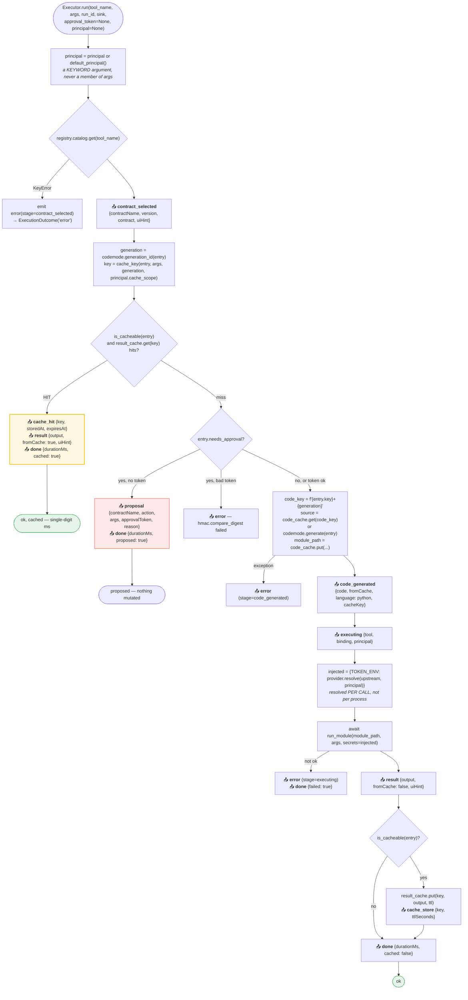

### 5.1 The cache-hit short circuit is the demo's climax

On a result-cache hit the executor emits `cache_hit` and returns immediately. It does
**not** emit `code_generated` or `executing` — *because those stages genuinely did not
happen.* The right pane is visibly shorter and faster on the second prompt, and it is
shorter for a true reason rather than a presentational one.

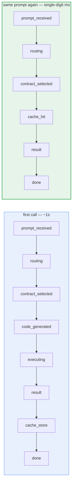

### 5.2 One cached module serves every principal

The generated module carries no credential — only the **name** of the environment
variable the sandbox will fill. So the code cache omits the principal on purpose: the
module is identical for everyone *precisely because the credential is not in it*. The
token is injected per call.

---

## 6. The sandbox

[`sandbox.py`](../../cm_mcp_engine/cm_engine/engine/sandbox.py). **Not a security
boundary** — a subprocess shares the filesystem and the network with its parent. This
stops accidents and runaway loops, not a determined attacker. Running untrusted
partner code would need a container or a jailed interpreter, explicitly out of scope
for the POC.

**What it does buy:** a real process boundary, a hard timeout, and an environment
carrying only the secrets the contract implied.

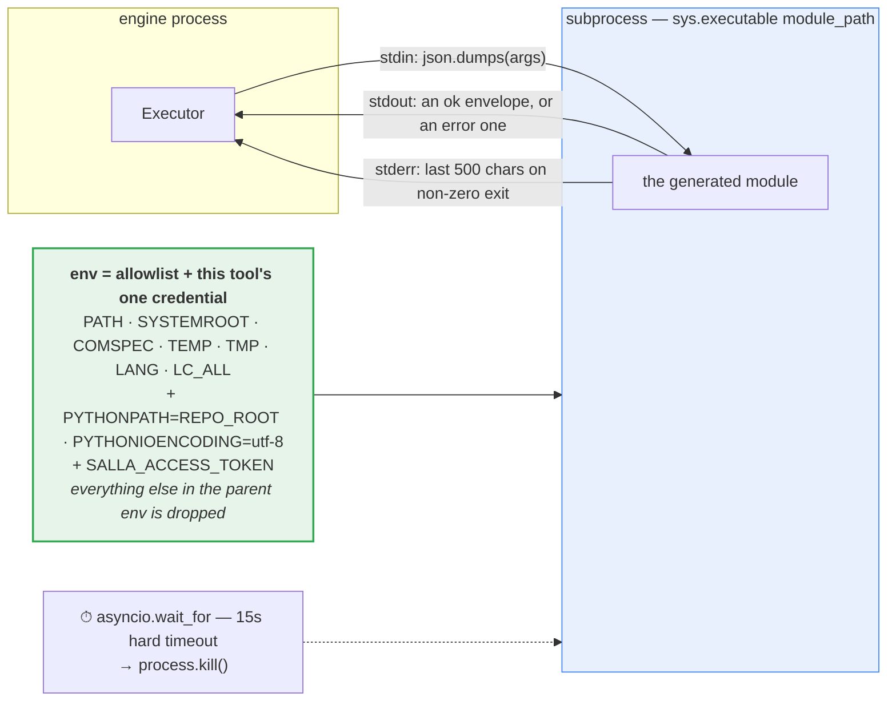

**Five ways a run comes back not-ok**, each with a distinct message:

| Condition | `SandboxResult.error` |
|---|---|
| `OSError` starting the process | `could not start sandbox: …` |
| exceeded 15s | `tool exceeded its 15.0s sandbox timeout` |
| non-zero exit | `sandbox exited {code}: {last 500 chars of stderr}` |
| empty stdout | `tool produced no output` |
| stdout is not JSON | `tool wrote non-JSON to stdout: {first 300 chars}` |
| `{"ok": false}` envelope | the module's own `ToolError` text — the contract's sentence |

`PYTHONPATH=REPO_ROOT` is there because the **builtin** template imports
`cm_engine.engine.builtins`; the HTTP template does not.

---

## 7. The two caches

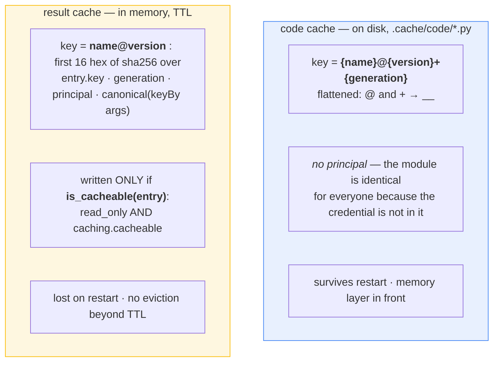

### 7.1 The result key — four components, each a bug if left out

| Component | Left out ⇒ |
|---|---|
| **the tool** (`entry.key`) | two tools collide |
| **the generation** | a corrected contract answered from its predecessor's results; `DEV_OFFLINE` off still serving mock-shaped answers |
| **the principal** | two merchants asking the same question see each other's data — *a breach rather than a bug, so it is a required argument with no default* |
| **the `keyBy` arguments** | either a trace id fragments the cache, or an argument that matters is ignored |

`keyBy` lets a contract declare which arguments actually affect the result, and the
gate enforces that they name real arguments.

### 7.2 `is_cacheable` — one gate, one place

```python
def is_cacheable(entry) -> bool:
    return bool(entry.read_only) and bool(entry.caching.get("cacheable"))
```

Both conditions must hold. And `read_only` is **derived, not believed**:

```python
@property
def read_only(self) -> bool:
    if self.method in {"POST", "PUT", "PATCH", "DELETE"}:
        return False                      # the verb decides
    return bool(self.annotations.get("readOnlyHint"))
```

The contracts gate already rejects a POST claiming `readOnlyHint: true` — but the gate
is a different machine from the one acting on the claim, and this engine also loads
sources that never passed it (a developer's working tree, a hand-edited pinned
artifact). **Caching a write is a correctness bug whatever a contract says about
itself.** The same reasoning makes `destructive` true for any DELETE, and
`needs_approval` true for any DELETE regardless of its governance block.

---

## 8. Propose-apply

A write that a human confirms before it happens.

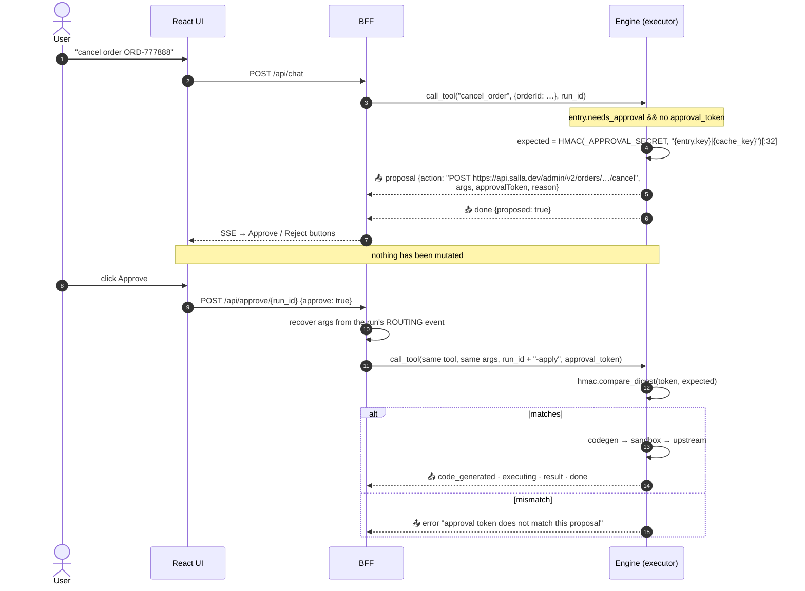

**The proposal preview shows the real request**, resolved through the contract's own
path mappings, with the wire names the upstream will see:

```
POST https://api.salla.dev/admin/v2/orders/777888/cancel
```

The approver should read what will actually be sent, not a paraphrase of it.

**Signing, and its POC limit.** `_APPROVAL_SECRET` is `secrets.token_hex(16)` minted
at import, so an "approved" write has to come from a proposal *this process* issued.
It is **process-local and lost on restart** — a restart between propose and apply
invalidates the token, which fails closed.

**A DELETE cannot opt out.** `needs_approval` returns `True` for `method == "DELETE"`
before it ever reads the governance block — not through the contract, and not by
arriving from a source with no gate in front of it.

---

## 9. Stage events

The executor emits stages as it works rather than returning one final blob. It never
knows how they travel: under FastMCP the sink forwards to `ctx.info(type, extra=payload)`
and they ride MCP log notifications; in tests the sink is a list.

### 9.1 The vocabulary — 11 types

| Event | Emitted by | Payload |
|---|---|---|
| `prompt_received` | BFF | `prompt` |
| `routing` | BFF | `chosen, rationale, candidates, args, source, usingLlm` |
| `contract_selected` | engine | `contractName, version, contract` *(the raw JSON)*, `uiHint` |
| `code_generated` | engine | `code` *(the real source)*, `fromCache, language, cacheKey` |
| `executing` | engine | `tool, binding, principal` |
| `result` | engine | `output, fromCache, uiHint` |
| `cache_store` | engine | `key, ttlSeconds` |
| `cache_hit` | engine | `key, storedAt, expiresAt` |
| `proposal` | engine | `contractName, action, args, approvalToken, reason` |
| `error` | either | `stage, message` |
| `done` | engine | `durationMs` + one of `cached` / `proposed` / `failed` |

`Emitter.emit` validates the type against `EVENT_TYPES` and raises on an unknown one —
so a typo fails at the emit site instead of showing up as a stage the UI silently
never renders, *which is exactly the sort of bug that survives to a demo*.

### 9.2 The envelope, and why it is nested

```json
{ "msg": "code_generated",
  "extra": { "stage_event": { "run_id": "run-8f2c…", "seq": 3, "ts": 1.7e9, "data": { … } } } }
```

`ctx.info(extra=…)` builds a stdlib `LogRecord`, which **raises on any key colliding
with a reserved attribute** — and two of our payloads do: `proposal` carries `args`,
every `error` carries `message`. Spreading the payload flat would make error reporting
the first thing to break. One wrapper key makes the whole class of collision
impossible, whatever a future event carries.

### 9.3 The journey to the browser

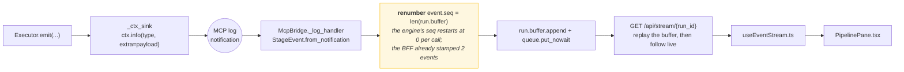

Events for an unknown `run_id` are dropped, and a notification that is not one of ours
returns `None` from `from_notification` and is ignored — ordinary server logging passes
through harmlessly.

---

## 10. A run, end to end

`"list recent shipped orders"`, first call, `DEV_OFFLINE=0`.

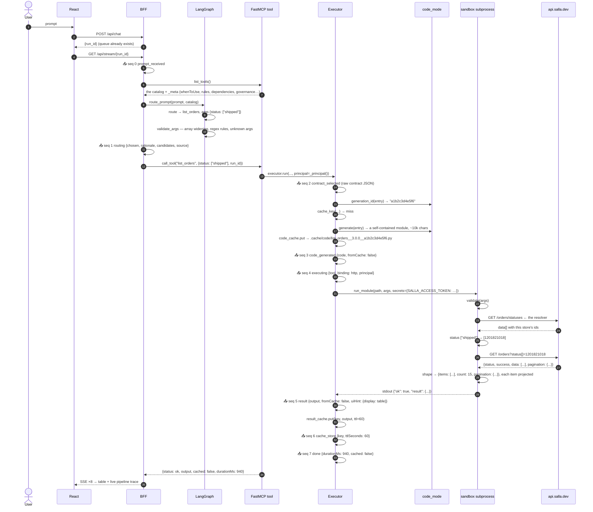

Ask the same thing again inside 60s and the trace is `prompt_received · routing ·
contract_selected · cache_hit · result · done` — six events, single-digit
milliseconds, and the two missing ones are missing because they did not happen.

---

## 11. Failure taxonomy

Where a failure surfaces tells you which layer owns it.

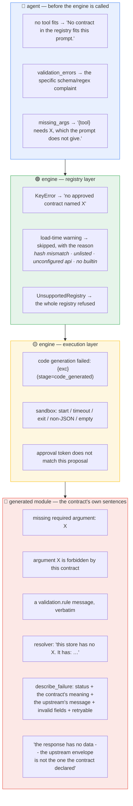

Every one of them arrives as an `error` stage event carrying `stage` and `message`, so
the right pane names the layer that failed rather than showing a blank.

### 11.1 Quick diagnosis

| Symptom | Most likely cause |
|---|---|
| an answer that looks complete but ignores the filter | the classic — a filter value that never resolved. With v2 `resolve` + `onMiss: error` this now fails loudly instead |
| a stale answer after correcting a contract | should be impossible — `generation_id` covers content, not just `contractVersion`. If it happens, check whether the contract file was edited *without* rebuilding the registry |
| answers that look like a mock in production | `DEV_OFFLINE` — the generated module's `BASE_URL` names the host it really calls, so read the `code_generated` event |
| a tool visible in the contracts repo but not in the UI | it was never pinned; see [ci-cd-workflows.md § 9.2](ci-cd-workflows.md#92-the-two-places-a-contract-can-be-rejected) |
| `list_contracts().source.origin` says *(unapproved)* | the engine is running with `CM_REGISTRY_FILE` or `CM_CONTRACTS_DIR` set |
| a write that returned a proposal twice | the process restarted between propose and apply — `_APPROVAL_SECRET` is process-local, and it fails closed |
